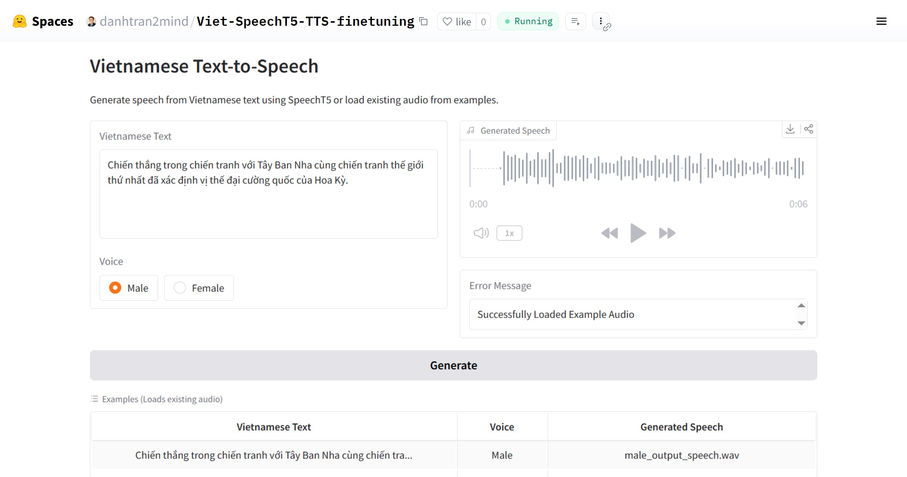

# Viet SpeechT5-TTS finetuning 🔈

## Introduction
Viet-SpeechT5-TTS-finetuning fine-tunes the Microsoft SpeechT5 model for high-quality Vietnamese Text-to-Speech (TTS) synthesis. It offers male and female voices, a Gradio interface for real-time demos, and a Python API for developers and researchers.

## Key Features
- 🎙️ **Vietnamese TTS Generation**: Fine-tuned SpeechT5 for natural Vietnamese speech.
- 🗣️ **Multiple Voice Options**: Supports male and female voices for diverse output.
- 🌐 **Interactive Gradio Interface**: Web-based GUI for real-time TTS testing.
- 🛠️ **Open-Source and Extensible**: Built on Hugging Face for easy customization.
- 🚀 **Pre-trained Model Access**: Available via Hugging Face for quick deployment.

<!-- ## Dataset -->

## Base Model

This project builds upon the [](https://huggingface.co/microsoft/speecht5_tts) model, fine-tuned for enhanced Vietnamese text-to-speech capabilities.

## Demonstration
Experience real-time Vietnamese TTS generation:  
- **HuggingFace Space**: [](https://huggingface.co/spaces/danhtran2mind/Viet-SpeechT5-TTS-finetuning)  

- **Demo GUI**:  
  

To run the Gradio app locally (`localhost:7860`):  
```bash
python app.py
```

## Installation

### Step 1: Clone the Repository
Clone the project repository and navigate to the project directory:  
```bash
git clone https://github.com/danhtran2mind/Viet-SpeechT5-TTS-finetuning.git
cd Viet-SpeechT5-TTS-finetuning
```

### Step 2: Install Dependencies
Install the required Python packages:  
```bash
pip install -r requirements.txt
```

## Usage

### Run Gradio App Locally
Launch the Gradio app for interactive TTS generation:  
```bash
python app.py
```

### Using Python API
Generate TTS audio output programmatically:  
```python
import torch
import soundfile as sf
from transformers import SpeechT5Processor, SpeechT5ForTextToSpeech, SpeechT5HifiGan
from datasets import load_dataset
import numpy as np
import json
import os

# Load processor, model, and vocoder
processor = SpeechT5Processor.from_pretrained("danhtran2mind/Viet-SpeechT5-TTS-finetuning")
model = SpeechT5ForTextToSpeech.from_pretrained("danhtran2mind/Viet-SpeechT5-TTS-finetuning")
vocoder = SpeechT5HifiGan.from_pretrained("microsoft/speecht5_hifigan")

def generate_speech(text, voice, output_path="tests/test_output/tts_output.wav"):
    print(f"Generating speech for text: {text}, voice: {voice}, output: {output_path}")
    if not text or not voice:
        return None, "Please provide both text and voice selection."
    
    speaker_dict = {"male": 2000, "female": 7000}
    try:
        speaker_id = speaker_dict[voice.lower()]
        speaker_embedding = torch.tensor(embeddings_dataset[speaker_id]["xvector"]).unsqueeze(0)
        inputs = processor(text=text, return_tensors="pt")
        
        with torch.no_grad():
            speech = model.generate_speech(
                inputs["input_ids"],
                speaker_embeddings=speaker_embedding,
                vocoder=vocoder,
                attention_mask=inputs.get("attention_mask")
            )
        
        sf.write(output_path, speech.numpy(), samplerate=16000)
        print(f"Audio saved to {output_path}")
        return output_path, None
    except Exception as e:
        print(f"Error generating speech: {str(e)}")
        return None, f"Error generating speech: {str(e)}"

text = ("Thắng lợi trong chiến tranh thế giới thứ hai và chiến tranh Lạnh tiếp tục "
        "khẳng định và giữ vững vị thế siêu cường của quốc gia này.")
voice = "Female"
generate_speech(text, voice, output_path="tests/test_output/tts_output.wav")
```

Show the generated audio:  
```python
from IPython.display import Audio
Audio("tests/test_output/tts_output.wav")
```
## Inference Examples
- Example 1:
  - Input text: Chiến thắng trong chiến tranh với Tây Ban Nha cùng chiến tranh thế giới thứ nhất đã xác định vị thế đại cường quốc của Hoa Kỳ.
  - Voice: Male
  - Output audio:
    
  https://github.com/user-attachments/assets/0fb6a55f-e7a5-43a7-a78f-ec62b1716c50

- Example 2:
  - Input text: Thắng lợi trong chiến tranh thế giới thứ hai và chiến tranh Lạnh tiếp tục khẳng định và giữ vững vị thế siêu cường của quốc gia này.
  - Voice: Female
  - Output audio:

  https://github.com/user-attachments/assets/ff3baf0f-f55b-4f56-8af7-3f1ab1a0f7f3

## Environment
- **Python**: 3.8 or higher
- **Key Libraries**: See [requirements.txt](requirements.txt) for compatible versions

## Contact
For questions or issues, please use the [GitHub Issues tab](https://github.com/danhtran2mind/Viet-Glow-TTS-finetuning/issues) or the [Hugging Face Community tab](https://huggingface.co/spaces/danhtran2mind/Viet-Glow-TTS-finetuning/discussions). 📬


